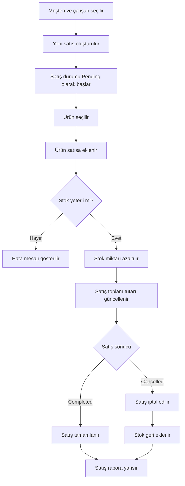

# Beyaz Eşya Bayi / Satış Otomasyonu

## Proje Özeti

- Bu proje, bir beyaz eşya bayisindeki müşteri, çalışan, ürün, kategori, stok ve satış süreçlerini yönetmek amacıyla geliştirilmiştir.
- Projenin temel odağı, SQL Server üzerinde ilişkisel veritabanı yapısını ve veritabanı nesnelerini doğru şekilde kullanmaktır.
- Sistem; satış oluşturma, stok güncelleme, satış raporlama ve müşteri satış geçmişi görüntüleme işlemlerini destekler.

## Geliştirme Ortamı

- **Veritabanı:** Microsoft SQL Server
- **Backend:** Java 17, Spring Boot, Maven
- **Frontend:** React.js, Vite, JavaScript
- **Araçlar:** VS Code, SQL Server Management Studio, Git, GitHub

## Problem Tanımı

- Beyaz eşya bayilerinde müşteri, ürün, stok ve satış bilgilerinin düzenli takip edilmesi gerekir.
- Satış sırasında ürün stoklarının doğru azaltılması önemlidir.
- Satış iptal edildiğinde ürün stoklarının geri eklenmesi gerekir.
- Satış toplam tutarlarının otomatik hesaplanması hata riskini azaltır.
- Bu proje, satış ve stok süreçlerini veritabanı iş kurallarıyla güvenli hale getirmek için geliştirilmiştir.

## Temel Özellikler

- Müşteri listeleme, ekleme ve güncelleme
- Çalışan listeleme, ekleme ve güncelleme
- Kategori listeleme ve ekleme
- Ürün listeleme ve kategoriye göre filtreleme
- Stok görünümü ve manuel stok güncelleme
- Yeni satış oluşturma
- Satışa ürün ekleme ve miktar güncelleme
- Satışı tamamlama veya iptal etme
- Genel satış raporu ve müşteri bazlı satış geçmişi

## Veritabanı Yapısı

- Projede 6 temel tablo bulunmaktadır:
  - `Customer`
  - `Employee`
  - `Category`
  - `Product`
  - `Sale`
  - `SaleDetail`
- Tablolar arasında müşteri-satış, çalışan-satış, kategori-ürün ve satış-satış detayı ilişkileri kurulmuştur.
- Veri bütünlüğü için Primary Key, Foreign Key, Unique, Check ve Default constraint yapıları kullanılmıştır.
- Veritabanında test işlemleri için dummy data bulunmaktadır.

## Kullanılan Veritabanı Nesneleri

- **Index:** Sorgu performansını artırmak için kullanılmıştır.
- **View:**
  - `vw_ProductStock`
  - `vw_SaleReport`
- **Trigger:**
  - Stok düşme ve stok iadesi
  - Satış toplam tutarının otomatik güncellenmesi
  - Satış durumu geçiş kontrolü
- **Stored Procedure:**
  - `sp_CreateSale`
  - `sp_AddSaleDetail`
  - `sp_UpdateSaleDetailQuantity`
  - `sp_UpdateSaleStatus`
  - `sp_GetCustomerSales`
  - `sp_UpdateProductStock`

## Veritabanı ER Diyagramı


## Yazılım Mimarisi

### Backend

```text
Controller -> Service -> Repository -> Database
```

- `Controller` katmanı HTTP isteklerini karşılar.
- `Service` katmanı iş akışını yönetir.
- `Repository` katmanı veritabanı işlemlerini yürütür.
- `DTO` yapıları frontend ile backend arasında veri taşımak için kullanılır.

### Frontend

```text
Page / View -> ViewModel Hook -> Service / API -> Backend
```

- `pages` klasörü kullanıcıya gösterilen ekranları içerir.
- `viewmodels` klasörü state ve form işlemlerini yönetir.
- `services` klasörü backend API çağrılarını içerir.
- `components` klasörü ortak arayüz parçalarını içerir.

## Akış Şeması



## Arayüz Görselleri

- Geliştirilen arayüzden örnek ekran görüntüleri bu alana eklenebilir.

```markdown


```

## Projeyi Çalıştırma

1. Repo indirilir:

```bash
git clone https://github.com/bersudemir/beyaz-esya-bayi-otomasyonu.git
cd beyaz-esya-bayi-otomasyonu
```

2. Veritabanı kurulur:

- `database/SQL_folder.sql` dosyası SQL Server Management Studio üzerinde çalıştırılır.

3. Backend veritabanı bilgileri düzenlenir:

- `backend/src/main/resources/application.properties` dosyasındaki kullanıcı adı ve şifre bilgileri yerel SQL Server bilgilerine göre düzenlenir.

```properties
spring.datasource.username=YOUR_DB_USERNAME
spring.datasource.password=YOUR_DB_PASSWORD
```

4. Backend çalıştırılır:

```bash
cd backend
mvn spring-boot:run
```

- Backend varsayılan olarak şu adreste çalışır:

```text
http://localhost:8080
```

5. Frontend çalıştırılır:

```bash
cd frontend
npm install
npm run dev
```

- Frontend varsayılan olarak şu adreste çalışır:

```text
http://localhost:5173
```

## Genel Yapı

- Veritabanı, sistemin iş kurallarını yöneten ana katmandır.
- Backend, SQL Server üzerindeki tablo, view, trigger ve stored procedure yapılarını REST API üzerinden kullanır.
- Frontend, kullanıcıların satış ve stok işlemlerini sade bir arayüz üzerinden yapmasını sağlar.
- Proje, veritabanı odaklı bir satış otomasyonu olarak tasarlanmıştır.

## Yapılan Araştırmalar

- SQL Server trigger ve stored procedure kullanımı araştırılmıştır.
- Spring Boot ile SQL Server bağlantısı incelenmiştir.
- JPA entity ilişkileri ve DTO kullanımı uygulanmıştır.
- React.js tarafında component, hook ve service yapısı araştırılmıştır.
- Frontend-backend API iletişimi kurulmuştur.
- CORS, SQL kullanıcı yetkileri ve stored procedure izinleriyle ilgili sorunlar çözülmüştür.

## Referanslar

- Microsoft SQL Server Documentation
- Spring Boot Documentation
- Spring Data JPA Documentation
- React Documentation
- Vite Documentation
- React Router Documentation
